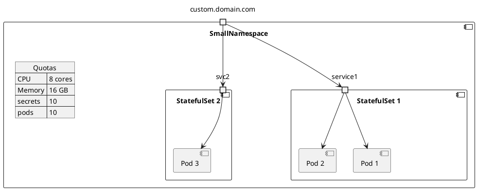

# Namespaces

The diagram represents namespaces as packages. Each package represents a separate namespace within the Kubernetes cluster. Within each namespace, it is depicted some of the different types of resources as components.

In the example, we have one package/namespace called `BigNamespace` representing a namespace where deployments and StatefulSets. Inside this package, we depict deployments as components, visually representing multiple instances of deployments.

Similarly, we have another package/namespace called `SmallNamespace` representing a namespace dedicated to stateful sets (this can be any other type of resource, of course). Inside this package, we illustrate stateful sets as components.

Within the components, we illustrate pods as smaller components, representing the individual instances of running processes within a namespace. We are connecting the pods to their respective deployments or stateful sets using appropriate arrows or lines.

To represent quotas, we either include them as JSON annotations attached to the namespaces or use notes to indicate the quotas assigned to each namespace. The JSON format can be depicted using a note with a JSON structure, or you can include the actual JSON representation as a note.


```plantuml
@startuml
allowmixing

' Kubernetes
!define KubernetesPuml https://raw.githubusercontent.com/dcasati/kubernetes-PlantUML/master/dist

!includeurl KubernetesPuml/kubernetes_Common.puml
!includeurl KubernetesPuml/kubernetes_Context.puml
!includeurl KubernetesPuml/kubernetes_Simplified.puml

!includeurl KubernetesPuml/OSS/KubernetesApi.puml
!includeurl KubernetesPuml/OSS/KubernetesIng.puml
!includeurl KubernetesPuml/OSS/KubernetesPod.puml
!includeurl KubernetesPuml/OSS/KubernetesDeploy.puml
!includeurl KubernetesPuml/OSS/KubernetesQuota.puml
!includeurl KubernetesPuml/OSS/KubernetesRs.puml

note "Route" as n
' Kubernetes Components
Cluster_Boundary(cluster, "Kubernetes Cluster") {
  portin "ecommerce.com" as ingress
  n .. ingress
  KubernetesIng(KIng, "Ingress/Route", "")
  'KubernetesApi(KubernetesApi, "Kubernetes API", "")
  Namespace_Boundary(nsBackEnd, "Back End") {
    json Quotas {
    "CPU": "8 cores",
    "Memory": "16 GB",
    "secrets": "21",
    "pods": "50"
    }
    'KubernetesQuota(KubernetesQuota, "Kubernetes Quota", "")

    component "Delivery App\n<<Deploy>>" as DeliveryApp {
      component "ReplicaSet" as rs2 {
        KubernetesPod(KubernetesDel1, "delivery-\napp-\n95e997438187", "")
        KubernetesPod(KubernetesDel2, "delivery-\napp-\nb02d12b9ae84", "")
      }
      portin svc2
    }
    component "Orders App\n<<StatefulSet>>" as OrdersApp {
      component "ReplicaSet" as rs1 {
        KubernetesPod(KubernetesBE1, "order-\napp-2", "")
        KubernetesPod(KubernetesBE2, "order-\napp-1", "")
        KubernetesPod(KubernetesBE3, "order-\napp-0", "")
      }
      portin service1
    }

    Rel_U(service1, KubernetesBE1, " ")
    Rel_U(service1, KubernetesBE2, " ")
    Rel_U(service1, KubernetesBE3, " ")
    Rel_U(svc2, KubernetesDel1, " ")
    Rel_U(svc2, KubernetesDel2, " ")
    KubernetesBE1 ..> svc2
    KubernetesBE2 ..> svc2
    KubernetesBE3 ..> svc2
    'KubernetesBE1 .. KubernetesDel1
    ingress .. KIng
    KIng -> service1
    KIng -> svc2
}

@enduml
```

